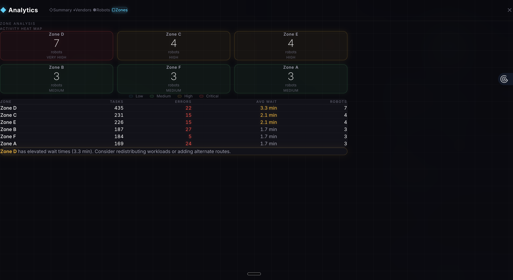
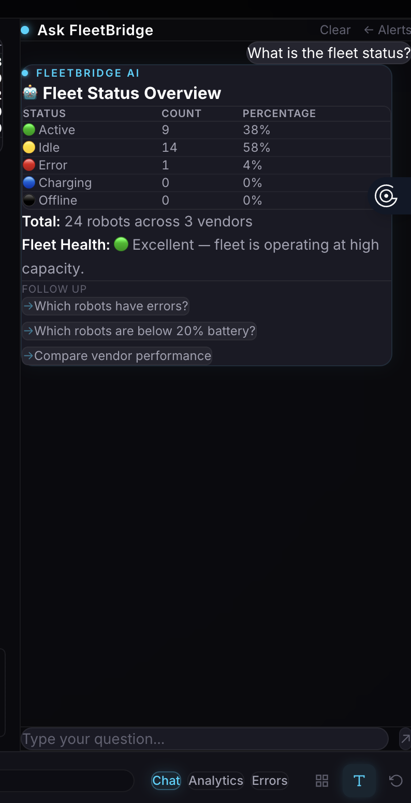
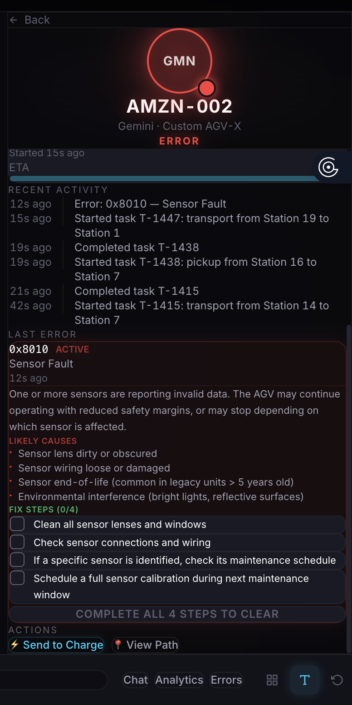
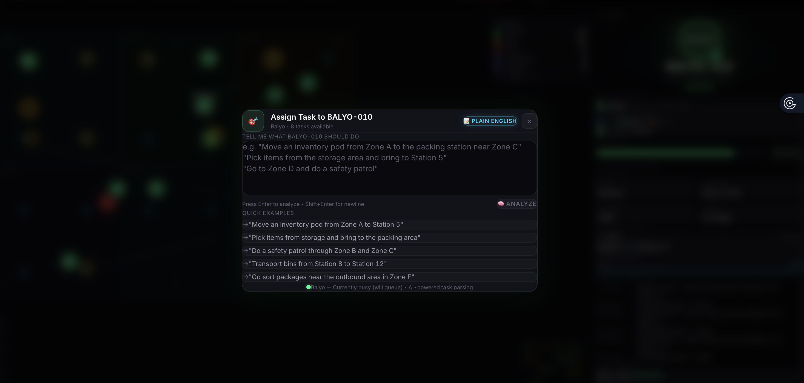
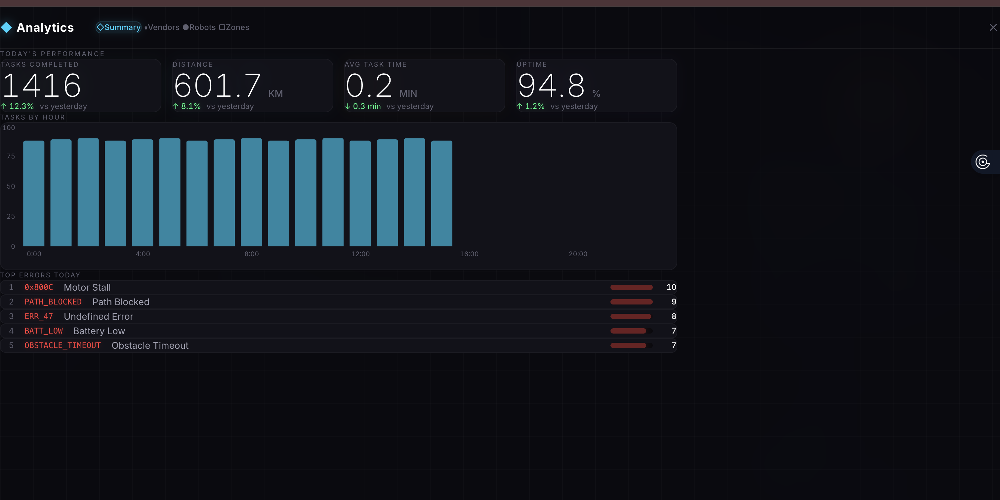
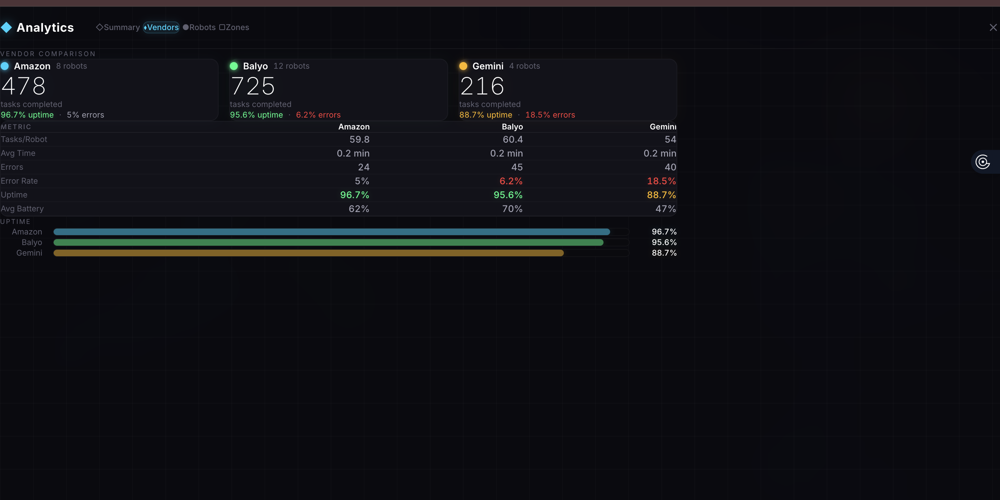
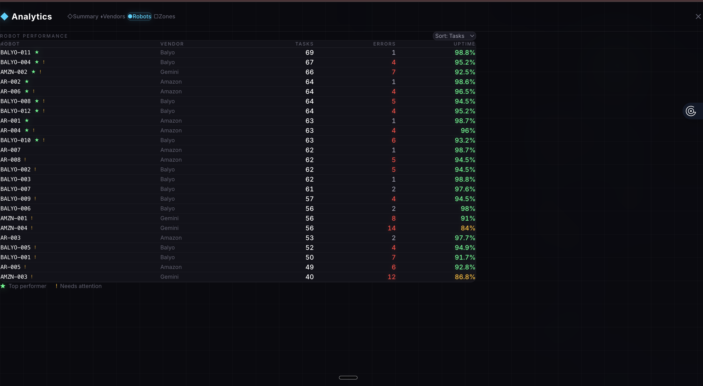

# FleetBridge

A single dashboard for managing robots from multiple vendors. Built for the AI Meets Robotics Hackathon 2025.


## Why

In 2023, robots collided at an Ocado warehouse in London and started a fire. $110M in damage. The facility went offline for months.

The root cause wasn't the robots — it was that each vendor's fleet runs on its own system. Operators had no way to see across vendors. An Amazon robot can't detect a Balyo robot heading for the same aisle. Error code `E-2002` means one thing on Amazon, something completely different on Balyo. When things go wrong, operators spend minutes just figuring out which dashboard to look at.

FleetBridge fixes that.

## What it does

It normalizes data from 3 robot vendors (Amazon, Balyo, Gemini — 24 robots total) into one live view. You get a real-time map, alerts when robots are about to collide, and you can ask questions in plain English instead of digging through menus.

The entire system runs on a WebSocket connection that pushes fleet state every 500ms. Every robot's position, battery level, task progress, and error state gets unified into a single data model regardless of which vendor built it. The backend simulates a real warehouse with 6 zones, 20 stations, charging docks, and realistic robot behavior — task assignment, pathfinding, battery drain, random errors, congestion.

## Features

### Live Map

The map renders on HTML5 Canvas — not DOM elements, not SVG. Every frame draws 24 robots with smooth position interpolation between WebSocket ticks so movement doesn't look choppy. Robots are color-coded by vendor (cyan for Amazon, green for Balyo, amber for Gemini) with status-based glow effects. Red pulsing glow means error. Blue means charging.

You can see zone boundaries, station markers, charging docks, and robot trails. Click any robot to open its detail panel. The conflict engine draws lines between robots on collision courses. Zoom with scroll wheel, pan with click-drag.



### Natural Language Queries

There's a search bar at the top of the screen. Type a question in plain English and get an answer.

Common queries like "what's the fleet status?" or "which robots have errors?" hit the local fallback handler and respond in about 50ms. The fallback covers location lookups, battery checks, status reports, vendor comparisons, zone analysis, alert summaries, error code lookups, and robot spotlights. It doesn't need an API call — it just reads the simulator state directly.

For anything the fallback can't handle — open-ended questions like "what should I prioritize right now?" or "why does Zone D have so many errors?" — the query gets sent to Google Gemini 2.5 Flash with full fleet context. That context includes every robot's position, status, battery, current task, error history, zone occupancy, active alerts, and analytics data. Gemini responds with a structured JSON payload containing markdown text, relevant robot IDs, suggested follow-ups, and a response type tag.

The system tries `gemini-2.5-flash` first, falls back to `gemini-2.0-flash`, then `gemini-2.0-flash-lite` if rate limited.



### Robot Detail Panel

Click any robot on the map or in a query result. You get its full profile: vendor, model, position, zone, battery with animated bar, current task with ETA progress, recent activity log, and last error with full diagnosis.

If the robot has an active error, you see the error code, description, likely causes, and a checklist of fix steps pulled from the error knowledge base. The panel also has actions — send to charge, view planned path, assign a new task.

When a robot is charging, the battery bar turns blue with a pulsing shimmer animation.



### Conflict Detection

The conflict engine runs every tick and checks for five types of problems:

1. **Collision courses** — two robots within 5 units and heading toward each other. The engine calculates future positions based on heading and speed, flags pairs that will intersect.
2. **Deadlocks** — two robots blocking each other's paths with neither able to proceed.
3. **Zone congestion** — more than a comfortable number of robots in one zone. Thresholds vary by zone size.
4. **Path blockages** — an idle or error-state robot sitting in the path of an active robot.
5. **Battery critical** — a robot below 15% battery that's still running a task instead of charging.

Each detected conflict generates an alert with severity (critical/warning/info), affected robot IDs, a description, and a suggested action. Alerts show up in the right panel with color-coded severity badges, and critical alerts pulse.

### AI Root Cause Analysis

When an alert fires, the RCA engine can dig deeper. It sends the alert context plus surrounding fleet state to Gemini and asks for a root cause analysis. The response explains not just what happened but the chain of events that led to it — "BALYO-010 timed out because AR-005 was blocking its path in Zone B, which was already congested with 7 robots, and AR-005 had been idle since its last task completed 45 seconds ago."

### Error Code Translation

The error knowledge base maps every vendor's error codes to a unified format. Each entry has the vendor code, a human-readable name, severity, description, list of common causes, step-by-step remediation, whether it's auto-recoverable, and cross-references to equivalent errors on other vendors.

So when a Balyo robot throws `OBSTACLE_TIMEOUT`, the system knows that's equivalent to Amazon's `E-2002` and Gemini's `0x8010`. An operator who's only familiar with Amazon's codes can still understand what's wrong with a Balyo robot.

The error lookup panel in the UI lets you search by code, keyword, or vendor, and shows the full diagnosis inline.

### Task Assignment

Click the task button on any robot's detail panel. A modal opens with a natural language input — type what you want the robot to do in plain English. "Move an inventory pod from Zone A to Station 5" or "pick items from storage and bring to the packing area."

Gemini parses the instruction into a structured task: task type, origin station, destination station, estimated time. The system validates that the task makes sense for the robot's vendor and current state before queueing it.



### Analytics

Four tabs: Summary, Vendors, Robots, Zones.

**Summary** shows today's KPIs — total tasks completed, distance covered, average task time, fleet uptime — each with a percent change from yesterday. Below that, a bar chart of tasks by hour and a ranked list of the most frequent errors.



**Vendors** compares the three vendors head-to-head. Tasks per robot, average task time, error count, error rate, uptime percentage, average battery. Uptime bars at the bottom give a visual comparison. You can see at a glance that Gemini's 4 robots have an 18.5% error rate while Amazon's 8 are at 5%.



**Robots** ranks all 24 robots by tasks completed, with columns for errors and uptime. Stars mark top performers, exclamation marks flag robots that need attention. Sortable by any column.



**Zones** shows a heatmap of zone activity — how many robots, how many tasks, error count, average wait time. Color-coded from green (low) to red (critical). The table below breaks it down with exact numbers. If a zone has elevated wait times, a warning suggests redistributing workloads.

### Alert Feed

The right panel shows a live stream of alerts sorted by time, filterable by severity. Each alert card shows the type, affected robots, a description, and three action buttons: Details (expand for full info), View (jump to the robot on the map), Acknowledge, and Resolve.

Critical alerts get a red badge and pulse animation. The header shows a count of critical vs total active alerts so you can triage at a glance.

## Tech stack

- **Frontend:** React 19, TypeScript, Tailwind v4, Vite 7, HTML5 Canvas
- **Backend:** Python, FastAPI, WebSocket (500ms updates)
- **AI:** Google Gemini 2.5 Flash
- **Data:** MindsDB

## Setup

You need Python 3.9+, Node 18+, and a [Gemini API key](https://aistudio.google.com/apikey).

```bash
git clone https://github.com/jaytrivediSF25/Fleet-Bridge.git
cd Fleet-Bridge
```

Backend:
```bash
cd backend
pip install -r requirements.txt
export GEMINI_API_KEY="your-key"
uvicorn main:app --reload --host 0.0.0.0 --port 8000
```

Frontend:
```bash
cd frontend
npm install
npm run dev
```

Open http://localhost:5173. The simulation starts on its own.

## Project structure

```
backend/
  main.py             # API server, WebSocket endpoint, REST routes
  simulator.py        # 24-robot fleet simulation with realistic behavior
  nl_engine.py        # NL query routing, Gemini integration, fallback handlers
  conflict_engine.py  # Collision, deadlock, congestion, path block detection
  analytics_engine.py # Daily summaries, vendor comparison, zone metrics
  rca_engine.py       # AI-powered root cause analysis via Gemini
  error_kb.py         # Cross-vendor error code knowledge base
  task_catalog.py     # Task type definitions and vendor compatibility
  facility.py         # Warehouse layout — zones, stations, chargers
  adapters.py         # Vendor-specific raw data to unified model adapters
  models.py           # Pydantic models for the entire domain

frontend/src/
  components/
    LiveMap.tsx        # HTML5 Canvas warehouse map with smooth interpolation
    TopBar.tsx         # NL search bar, fleet status pills, response overlay
    AlertFeed.tsx      # Real-time alert stream with severity filtering
    RobotDetail.tsx    # Per-robot status, task, error, activity panel
    ChatPanel.tsx      # Conversational AI chat interface
    ErrorLookup.tsx    # Error code search and cross-vendor translation
    TaskAssignModal.tsx # NL task assignment with Gemini parsing
    Analytics/         # Summary, Vendors, Robots, Zones views
  context/
    FleetContext.tsx   # Global state — robots, alerts, selections, views
  hooks/
    useWebSocket.ts   # Real-time fleet data subscription
    useChat.ts        # Chat message state and API calls
```

## Team

Jay Trivedi, Nicholas Lin
